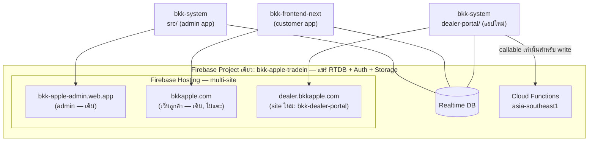
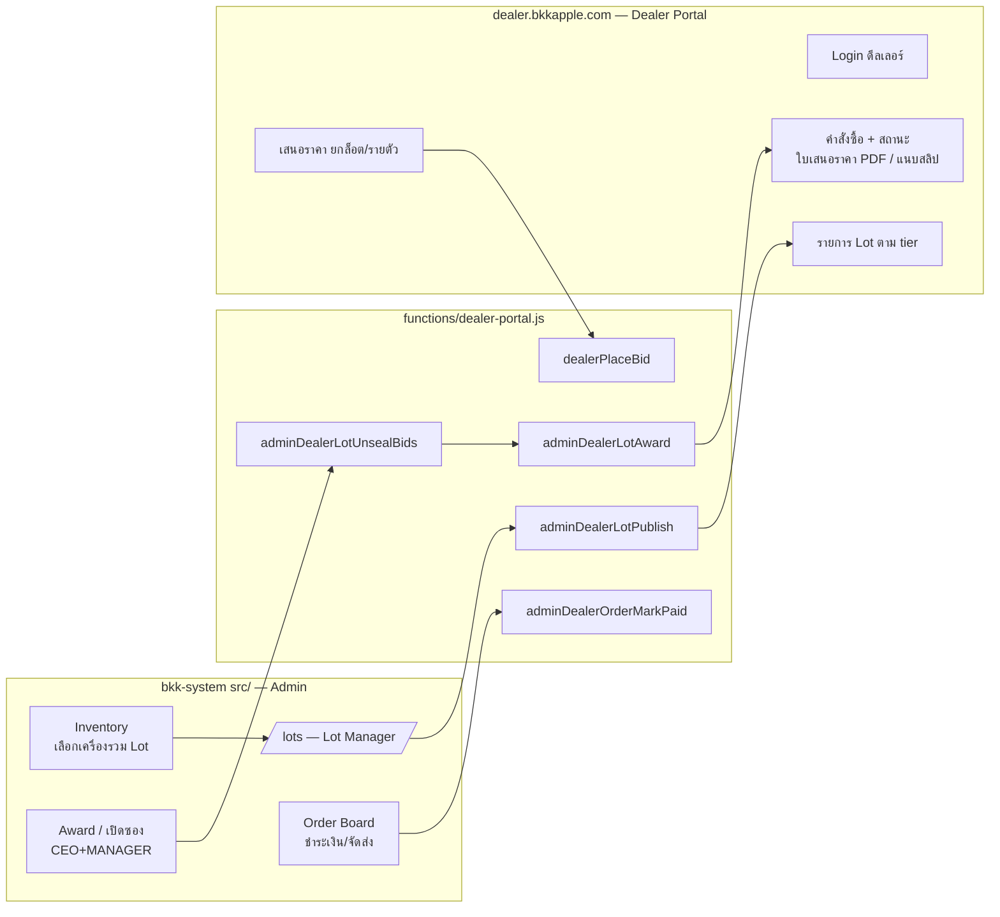
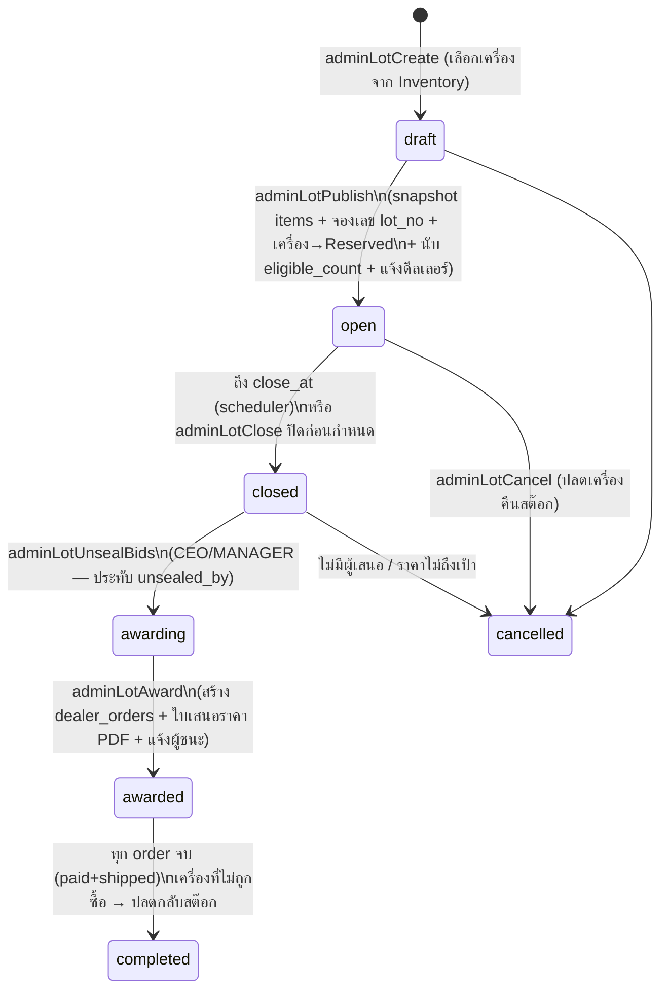

# Dealer Portal — ระบบขายส่งยกล็อต + ประมูลแบบปิดซอง (Design Doc)

> สถานะ: **Implement แล้วครบ Phase 1–3** (ส.ค. 2026) — เอกสารนี้คือดีไซน์อ้างอิง; สรุปการใช้งานจริง+จุดที่ต่างเล็กน้อยดู section "Dealer Portal" ใน `CLAUDE.md`. จุดต่างจากดีไซน์: (1) การสร้าง lot ใช้ item picker ในหน้า `/lots` แทน multi-select ใน Inventory (ครอบคลุมกว่า) (2) shared types ใช้ pattern mirror 3 ที่ตามธรรมเนียม repo แทนโฟลเดอร์ `shared/` (3) เพิ่ม `dealerListOrders` (ดีลเลอร์ query ลิสต์ order ตรงไม่ได้เพราะ collection read เป็น admin-only) (4) เพิ่มหน้า `/dealer-analytics`
> การตัดสินใจที่ยืนยันแล้ว: แก้ซองได้จนปิดรับ (เก็บ history) · มี reserve price ต่อ lot (เก็บใน lot_private) · ตัวเลข 5/30 default เห็นเฉพาะแอดมิน + toggle `show_bid_stats` ต่อ lot · ราคาเสนอ = รวม VAT
> เขียน: ส.ค. 2026
> Dealer Portal เป็น**แอปแยก + ซับโดเมนแยก** (`dealer.bkkapple.com`) — โค้ดอยู่ใน `bkk-system/dealer-portal/`, business logic อยู่ `bkk-system/functions/`, database rules ยัง deploy จาก `bkk-frontend-next` (canonical เดิม). **เว็บลูกค้า (`bkk-frontend-next`) ไม่ถูกแตะเลยนอกจากไฟล์ rules**

---

## 1. โจทย์ธุรกิจ

ธุรกิจหลักคือ**ขายส่งยกล็อต** ไม่ใช่ขายปลีก:

1. สินค้าเข้าสต๊อกทุกวัน → แอดมินรวมเป็น **Lot** และรันเลข Lot เพื่อเสนอขายดีลเลอร์
2. ปัจจุบันเสนอขายผ่าน LINE ส่วนตัว → **track ย้อนหลังไม่ได้** ว่าเสนออะไร/ราคาเท่าไหร่/ให้ใคร
3. ปิดดีลใน LINE แล้วต้องไปออก**ใบเสนอราคาในอีกโปรแกรม** (คีย์มือ) → ช้า ผิดพลาดง่าย
4. ต้องการ: ระบบหลังบ้านจัดการดีลเลอร์แบ่ง **tier**, portal ให้ดีลเลอร์ login เข้ามาดู lot และ**เสนอราคา** (ยกล็อตหรือรายตัว)
5. **กันทุจริต**: แอดมินต้องไม่เห็นว่าใครเสนอเท่าไหร่ระหว่างเปิดรับราคา — เห็นได้แค่จำนวนผู้เสนอ เช่น `5/30`
6. ปิดรับแล้วผู้มีอำนาจ**อนุมัติ**ผู้ชนะ → ระบบออกใบเสนอราคาอัตโนมัติ → ดีลเลอร์ชำระเงิน → จัดส่ง → ติดตามสถานะได้ในระบบ

## 2. หลักการออกแบบ (ยึดตามสถาปัตยกรรมเดิม)

| หลักการ | เหตุผล / ที่มาในระบบเดิม |
|---|---|
| **สต๊อก = view ของ `/jobs`** — Lot เป็น node ใหม่ที่ถือ *snapshot* ของสินค้า | ดีลเลอร์อ่าน `/jobs` ไม่ได้ (rules) และห้ามให้ client จำนวนมาก subscribe `/jobs` (RTDB cost rules) |
| **เรื่องเงิน/สถานะสำคัญเขียนผ่าน cloud function เท่านั้น** — rules ปิด client write | pattern เดียวกับ `staff-accounts.js` (`.write: false` + Admin SDK เป็นผู้เขียนคนเดียว) |
| **Sealed bid = ปิด read ที่ node bids สนิททุกฝั่ง** แล้วเปิดซองผ่าน callable ที่เช็ค role ฝั่ง server | rules แยกได้แค่ admin/ไม่ admin — จะกันแอดมิน role STAFF เห็นราคาต้องไม่มี read path ฝั่ง client เลย |
| **เลขเอกสารรันผ่าน transaction allocator** แบบเดียวกับ `allocateTaxInvoiceNumber` | atomic กันเลขซ้ำ มีอยู่แล้วใน `functions/index.js` |
| **จ่ายเงินแล้ว → เขียน `/sales` record** ให้ `onSaleCreated` เดิมออกใบกำกับภาษี + ลง `accounting_documents` | เข้า ภ.พ.30 / P&L เดิมโดยไม่ต้องสร้าง pipeline บัญชีใหม่ |
| **ต้นทุน lot ใช้ `stockCost(job)` เสมอ** | invariant เดิม (กันนับต้นทุน accessory ซ้ำ) |
| **ชื่อ cloud function ต้อง unique ระดับ project + ขึ้นต้น `dealer`/`adminDealer`** | Firebase identify ด้วย `{region}/{name}` — ชนกับ rider codebase = ทับกันเงียบๆ |
| **Rules ใหม่ทั้งหมดแก้ที่ `bkk-frontend-next/database.rules.json`** แล้ว deploy จาก repo นั้น | canonical source เดิม |

## 3. สถาปัตยกรรม — Bounded Context แยกขาดจากโดเมนหลัก

### 3.1 Topology (แอปไหนอยู่ไหน)



**ข้อตัดสินใจหลัก:**

| เรื่อง | ตัดสินใจ | เหตุผล |
|---|---|---|
| โดเมน | **ซับโดเมนแยก `dealer.bkkapple.com`** — Firebase Hosting **site ใหม่** (multi-site ในโปรเจกต์เดิม) | แยกขาดจากเว็บลูกค้า (SEO/cache/robots คนละโลก), แยกจาก admin (คนละ audience คนละความเสี่ยง) แต่ยังอยู่โปรเจกต์ Firebase เดิม → ใช้ RTDB/Auth/Storage ก้อนเดียว ไม่ต้อง sync ข้อมูลข้ามโปรเจกต์ |
| โค้ดของ portal | **แอป Vite+React ใหม่ที่ `bkk-system/dealer-portal/`** (package.json ของตัวเอง — ไม่ปน `src/` ของ admin) | ฝั่งขาย (admin lot manager + dealer portal + functions) เป็น bounded context เดียวกัน อยู่ repo เดียว → แชร์ types/utils ได้ (`shared/` ดู 3.2), CI เดียว, ไม่ต้องเปิด repo ใหม่. **เว็บลูกค้าไม่เกี่ยวกับ context นี้เลย** — bkk-frontend-next ถูกแตะแค่ไฟล์ `database.rules.json`/`storage.rules` (canonical เดิม) |
| Business logic | ทั้งหมดอยู่ `bkk-system/functions/dealer-portal.js` — portal **เขียนอะไรตรงๆ ไม่ได้เลย** (rules ปิด) ทุก write ผ่าน callable | pattern เดิมของระบบ (staff-accounts) + จำเป็นต่อ sealed bid |
| Auth | Firebase Auth โปรเจกต์เดิม, ดีลเลอร์ login email/password | ต้องเพิ่ม `dealer.bkkapple.com` ใน **Authorized domains** ของ Firebase Auth. ใช้ `signInWithEmailAndPassword` ตรงๆ ไม่มี redirect flow → ไม่เจอปัญหา authDomain ข้าม site |
| เว็บลูกค้า | route `/portal` ของเว็บลูกค้าเป็นหน้า marketing อยู่แล้ว — **ไม่ยุ่ง** | กันสับสน: dealer portal ไม่มีตัวตนบนโดเมนหลัก |

### 3.2 การแบ่ง Bounded Context ในระดับโค้ดและข้อมูล

หลักการ: **โดเมน "ขายส่ง" (dealer/lot/bid/order) แตะโดเมนหลัก (jobs/สต๊อก/บัญชี) ผ่านจุดสัมผัสที่ประกาศไว้เท่านั้น** — ทั้งหมดทำฝั่ง server:

| จุดสัมผัสกับโดเมนหลัก | ทิศทาง | ใครทำ |
|---|---|---|
| อ่าน job ที่ถูกเลือกเข้า lot → สร้าง snapshot | jobs → lots (อ่านรายตัว) | `adminDealerLotPublish` |
| ล็อก/ปลดเครื่อง: `status: Reserved` + `lot_id` | lots → jobs | publish / cancel / award |
| ตัดสต๊อก: `status: Sold` + `sold_channel: 'dealer'` | order paid → jobs | `adminDealerOrderMarkPaid` |
| ออกใบกำกับภาษี + บัญชี: เขียน `/sales` record | order paid → sales | `adminDealerOrderMarkPaid` (แล้ว `onSaleCreated` เดิมทำงานต่อ) |

นอกเหนือจาก 4 จุดนี้ **โดเมน dealer ห้ามแตะ node เดิมใดๆ** — node ใหม่ทุกตัวมี prefix ชัด (`dealers`, `lots`, `lot_bids`, `lot_private`, `lot_audit`, `dealer_orders`, `settings/dealer`) และสถานะออเดอร์เป็น enum ใหม่ ไม่ยุ่ง `job-statuses.ts` (ไม่ต้อง sync 3 repo)

โครงไฟล์ใน `bkk-system` (monorepo-style):

```
bkk-system/
├── src/                      # admin app (เดิม) — เพิ่มหน้า /dealers, /lots, /dealer-orders
├── dealer-portal/            # แอปใหม่ (Vite+React, package.json ของตัวเอง)
│   ├── src/
│   └── vite.config.ts
├── shared/dealer/            # types + utils ที่ admin app และ dealer-portal ใช้ร่วม
│   ├── types.ts              # Lot, DealerBid, DealerOrder, สถานะ, tier
│   └── format.ts             # เลขเอกสาร, mask serial, ฯลฯ
├── functions/
│   ├── dealer-portal.js      # business logic ทั้งหมดของโดเมนนี้ (ไฟล์ใหม่)
│   └── index.js              # เดิม — แค่ re-export functions ใหม่
└── firebase.json             # เพิ่ม hosting target "dealer"
```

- `shared/dealer/` เป็น TS ที่ทั้งสองแอป import ได้ (functions เป็น JS import ไม่ได้ — ค่า enum/แมพที่ server ใช้ต้อง mirror ใน `dealer-portal.js` แบบเดียวกับที่ `notification-settings.js` mirror TS อยู่แล้ว และจดไว้ใน header ของทั้งสองไฟล์)
- ถ้าอนาคตทีมโตจนอยากแยก repo — ตัด `dealer-portal/` + `shared/dealer/` ออกไปได้ทั้งก้อนเพราะไม่ import อะไรจาก `src/` ของ admin (**กฎ: dealer-portal ห้าม import จาก `../src`**)

### 3.3 Deployment / CI

- `firebase.json`: เพิ่ม hosting target ใหม่ → `"target": "dealer", "public": "dealer-portal/dist"` และผูก target กับ site `bkk-dealer-portal` (`firebase target:apply hosting dealer bkk-dealer-portal`)
- ตั้ง custom domain `dealer.bkkapple.com` ชี้ site ใหม่ใน Firebase console (DNS: A/TXT ตามที่ console บอก)
- `.github/workflows/firebase-hosting-deploy.yml`: เพิ่ม step build `dealer-portal/` (`npm ci && npm run build` ใน subdir) + deploy `--only hosting:dealer` — ใช้ secrets ชุด `VITE_FIREBASE_*` เดิม
- Functions ใหม่ deploy ไปกับ workflow เดิมอยู่แล้ว (functions อยู่ codebase เดิม — ชื่อไม่ชนกับ rider ตามกฎ naming ข้อ 7)
- เพิ่ม `dealer.bkkapple.com` ใน Firebase Auth → Settings → Authorized domains

### 3.4 Flow หลัก



## 4. Data Model (RTDB)

### 4.1 `dealers/{uid}` — ทะเบียนดีลเลอร์

key = Firebase Auth uid ของบัญชีดีลเลอร์ (แบบเดียวกับ staff ↔ auth)

```jsonc
{
  "company_name": "หจก. โฟนช็อป",
  "tax_id": "0105561234567",          // เลขผู้เสียภาษี — ใช้ออกใบกำกับเต็มรูป
  "address": "…",                      // ที่อยู่จดทะเบียน
  "contact_name": "คุณเอ",
  "phone": "0812345678",
  "email": "a@phoneshop.co.th",       // lowercase — ใช้ lookup แบบ staff
  "line_id": "…",                      // optional, ช่วงเปลี่ยนผ่านจาก LINE
  "tier": "A",                         // A | B | C (config ที่ settings/dealer/tiers)
  "status": "ACTIVE",                  // PENDING | ACTIVE | SUSPENDED
  "created_at": 0, "created_by": "staffId",
  "approved_at": 0, "approved_by": "staffId",
  "stats": { "orders": 12, "total_amount": 1500000, "last_order_at": 0 }  // server เขียน
}
```

- **วงจรบัญชีผ่าน callable เท่านั้น** (`adminDealerCreate/Update/SetStatus`) — copy pattern `staff-accounts.js`: สร้าง Auth user + ตั้งรหัสผ่านชั่วคราว, SUSPENDED = disable auth user + revoke refresh tokens (ดีลเลอร์ที่เปิดหน้าเว็บค้างโดนเตะออก)
- Phase แรก**ไม่เปิด self-register** — แอดมินสร้างบัญชีให้ (ดีลเลอร์เป็นคู่ค้าที่รู้จักกันอยู่แล้ว) ลดงาน KYC/อนุมัติ. เผื่อ `status: PENDING` ไว้สำหรับ phase หลัง

### 4.2 `settings/dealer/` — คอนฟิก (แอดมินแก้ผ่าน UI ตั้งค่า)

```jsonc
{
  "tiers": {
    "A": { "label": "Platinum", "early_access_min": 60, "order": 1 },
    "B": { "label": "Gold",     "early_access_min": 0,  "order": 2 },
    "C": { "label": "Silver",   "early_access_min": 0,  "order": 3 }
  },
  "lot_no_prefix": "LOT-",             // เลขล็อต: LOT-202608-0001 (reset รายเดือน)
  "quotation_prefix": "QT-",           // เลขใบเสนอราคา
  "lot_seq_by_period": { "202608": 4 },       // counter — transaction เท่านั้น
  "quotation_seq_by_period": { "202608": 2 },
  "payment_info": { "bank": "…", "account_no": "…", "account_name": "…" },
  "default_bid_hours": 24
}
```

- tier มีผลจริง 2 อย่าง: **มองเห็น lot ไหนบ้าง** (แอดมินเลือกตอน publish) และ **early access** (tier สูงเห็นก่อน X นาที). เรื่อง credit term เก็บไว้ phase หลัง
- counter ใช้ pattern `allocateTaxInvoiceNumber` (RTDB `transaction()`) — เขียน helper `allocateDealerDocNumber(db, kind, now)` ใน `dealer-portal.js`

### 4.3 `lots/{lotId}` — ล็อตสินค้า

```jsonc
{
  "lot_no": "LOT-202608-0001",
  "title": "iPhone 14/15 คละเกรด 22 เครื่อง",
  "description": "…",
  "status": "open",       // draft | open | closed | awarding | awarded | completed | cancelled
  "bid_mode": "both",     // whole_lot | per_item | both — ดีลเลอร์เสนอแบบไหนได้บ้าง
  "items": {              // SNAPSHOT — สร้างโดย server ตอน publish, ดีลเลอร์อ่านจากตรงนี้เท่านั้น
    "<jobId>": {
      "model": "iPhone 15 Pro 256GB Natural Titanium",
      "ref_no": "T-2608-0113",
      "grade": "A",                    // QCGrade
      "parts_condition": "Original",
      "battery_pct": 92,               // ถ้ามีจากผลตรวจ
      "accessories": "เครื่องเปล่า",
      "serial_masked": "••••••XK92",   // 4 ตัวท้าย — ห้ามใส่ serial/IMEI เต็ม
      "photos": ["https://…"],         // optional, URL จาก Storage เดิมของงาน
      "asking_price": 26500            // optional — ราคาตั้ง/ราคาอ้างอิงต่อเครื่อง
    }
  },
  "item_count": 22,
  "asking_total": 480000,              // optional
  "visible_tiers": { "A": true, "B": true },   // map (ไม่ใช่ array) — เพื่อเช็คใน rules ได้
  "open_at": 0,                        // เวลาเริ่มให้ tier ปกติเห็น (tier ที่มี early_access เห็นก่อน)
  "close_at": 0,                       // ปิดรับราคา — server บังคับ
  "eligible_count": 30,                // จำนวนดีลเลอร์ที่มีสิทธิ์เห็น lot นี้ (ตัวส่วนของ 5/30)
  "bid_stats": { "bid_count": 5 },     // server เขียนอย่างเดียว — สิ่งเดียวที่ทุกคนเห็นเกี่ยวกับ bids
  "created_at": 0, "created_by": "staffId", "published_at": 0,
  "unsealed_at": 0, "unsealed_by": "staffId",   // ประทับตอนเปิดซอง (audit)
  "award": {                           // เขียนตอนอนุมัติ (server)
    "type": "whole_lot",               // whole_lot | per_item
    "dealer_uid": "…",                 // ผู้ชนะยกล็อต
    "item_awards": { "<jobId>": { "dealer_uid": "…", "amount": 26500 } },  // กรณีรายตัว
    "total_amount": 495000,
    "approved_by": "staffId", "approved_at": 0
  }
}
```

**จุดสำคัญ:**
- `items` เป็น **snapshot ที่ตัดข้อมูลอ่อนไหวออกแล้ว** (ไม่มี serial เต็ม, ไม่มี stock_cost, ไม่มีข้อมูลลูกค้าเดิมของเครื่อง) — สร้างโดย `adminLotPublish` จากการอ่าน job รายตัว (**อ่านเฉพาะ id ที่เลือก — ห้ามกวาด `/jobs` ทั้งก้อน**)
- ต้นทุนรวมของ lot (จาก `stockCost()`) **ไม่เก็บใน `lots/`** ที่ดีลเลอร์อ่านได้ — เก็บใน `lot_private/{lotId}` (read = admin, write = false) ให้แอดมินดู margin ตอนเปิดซอง
- `visible_tiers` เป็น **map** เพราะ rules เช็ค membership ใน array ไม่ได้ แต่เช็ค `.child(tier).exists()` ได้

### 4.4 การล็อกเครื่องเข้า Lot (ฝั่ง `/jobs`)

ตอน `adminLotPublish`:
- ตรวจว่าทุก job อยู่ในสถานะขายได้ (`In Stock`/`Ready to Sell`) และยังไม่ติด lot อื่น
- เขียน multi-path update: `jobs/{id}/status = "Reserved"` + `jobs/{id}/lot_id = lotId` + `jobs/{id}/lot_no`
- `Reserved` เป็นสถานะที่ประกาศไว้แล้วใน `job-statuses.ts` แต่**ยังไม่มีใครเขียน** — เอามาใช้ตรงนี้พอดี **ไม่ต้องเพิ่ม status ใหม่** (เลี่ยงการ sync enum 3 repo)
- ยกเลิก lot / เครื่องไม่ถูกประมูล → server คืนสถานะเดิม + ลบ `lot_id`

**Guard ที่ต้องเพิ่มในของเดิม (bkk-system):**
- `POS.tsx` — สแกนเจอเครื่อง `Reserved` หรือมี `lot_id` → ปฏิเสธ พร้อมบอกเลข lot
- `Inventory.tsx` — แถวที่ติด lot แสดง badge เลข lot + ปุ่ม Push to POS / Mark Sold ต้อง disable

### 4.5 `lot_bids/{lotId}/{dealerUid}` — ซองราคา (SEALED)

```jsonc
{
  "bid_no": "B-0007",                  // เลขลำดับภายใน lot (server รัน)
  "type": "whole_lot",                 // whole_lot | per_item
  "amount_total": 495000,              // กรณียกล็อต
  "item_bids": { "<jobId>": 26500 },   // กรณีรายตัว (เสนอเฉพาะเครื่องที่ต้องการได้)
  "note": "รับของเองที่ร้าน",
  "created_at": 0, "updated_at": 0,
  "history": [                         // append-only — แก้ราคาได้ก่อนปิดรับ แต่ประวัติไม่หาย
    { "at": 0, "type": "whole_lot", "amount_total": 480000 }
  ]
}
```

**กลไก sealed (หัวใจของการกันทุจริต):**

| ชั้น | กติกา |
|---|---|
| Database rules | `lot_bids` → `.read: false, .write: false` **ทุกคนรวมทั้ง admin** — ไม่มีทางอ่านจาก client ได้เลย |
| เขียน bid | ผ่าน `dealerPlaceBid` (callable) เท่านั้น — Admin SDK เขียน |
| ดีลเลอร์เห็นอะไร | เห็นเฉพาะ **ซองของตัวเอง** — callable `dealerGetMyBid` คืนให้เฉพาะ `auth.uid` ตัวเอง |
| แอดมินเห็นอะไร | เห็นแค่ `lots/{id}/bid_stats.bid_count` (เช่น 5/30) — server เป็นคนนับ |
| เปิดซอง | `adminLotUnsealBids` — เช็ค role **CEO/MANAGER** ฝั่ง server (pattern `requireCeoCaller` ของ `staff-accounts.js` แต่ generalize เป็น `requireStaffRole(db, auth, ['CEO','MANAGER'])`) และเช็คว่า `lot.status === 'closed'` แล้วเท่านั้น — เปิดก่อนปิดรับไม่ได้แม้เป็น CEO |
| ร่องรอย | การเปิดซองประทับ `unsealed_at/unsealed_by` ลง lot + เขียน `lot_audit` — ใครเปิด เมื่อไหร่ ตรวจย้อนได้เสมอ |
| แก้ราคา | แก้ได้จนกว่าจะปิดรับ แต่ทุกครั้งต่อท้าย `history` — ลบ/แก้ย้อนหลังไม่ได้ (server ไม่มี path ลบ) |

> ทำไมไม่ใช้ rules แยก role: rules ของระบบนี้รู้จักแค่ "เป็น admin หรือไม่" (`/admins/{uid}/role === 'admin'`) — role CEO/MANAGER/STAFF/FINANCE อยู่ที่ `/staff` และบังคับกันฝั่ง server เท่านั้น การปิด read สนิทแล้วให้ callable เป็นประตูเดียว จึงเป็นทางเดียวที่กัน STAFF (ซึ่งก็เป็น admin ใน rules) ไม่ให้เห็นราคาได้จริง

### 4.6 `lot_audit/{lotId}/{pushId}` — บันทึกเหตุการณ์ (append-only)

```jsonc
{ "at": 0, "event": "bid_placed", "actor": "dealer:<uid>", "detail": { "revision": 2 } }
// events: published | bid_placed | bid_revised | closed | unsealed | awarded | order_created | cancelled
```
- rules: `.read` = admin (ให้หน้า lot detail โชว์ timeline ได้ — **ราคาไม่อยู่ในนี้** จนกว่าจะ unsealed), `.write: false`
- ตอบโจทย์ "track ย้อนกลับไม่ได้" ของระบบ LINE เดิมโดยตรง

### 4.7 `dealer_orders/{orderId}` — คำสั่งซื้อหลังอนุมัติ

```jsonc
{
  "order_no": "DO-202608-0003",
  "lot_id": "…", "lot_no": "LOT-202608-0001",
  "dealer_uid": "…",
  "dealer_snapshot": { "company_name": "…", "tax_id": "…", "address": "…" },  // ตอน award
  "type": "whole_lot",
  "items": { "<jobId>": { "model": "…", "ref_no": "…", "amount": 26500 } },
  "amount": 495000,                    // VAT-inclusive (แนวเดียวกับ POS)
  "status": "pending_payment",
  // pending_payment → payment_review → paid → preparing → shipped → completed | cancelled
  "quotation": { "number": "QT-202608-0002", "pdf_url": "…", "issued_at": 0 }, // server สร้าง
  "payment": { "slip_url": "…", "submitted_at": 0, "verified_by": "staffId", "verified_at": 0 },
  "sale_id": "…",                      // ชี้ /sales record ที่สร้างตอน paid
  "shipping": { "method": "kerry", "tracking_no": "…", "shipped_at": 0 },
  "status_log": [ { "status": "paid", "at": 0, "by": "…" } ],
  "created_at": 0
}
```

- rules: `.read` = admin, `$orderId` read เพิ่มเมื่อ `data.child('dealer_uid').val() === auth.uid` (pattern เดียวกับ ownership read ของ `jobs`), `.write: false` ทั้งหมด — เปลี่ยนสถานะผ่าน callable
- สถานะออเดอร์เป็น **enum ใหม่แยกจาก job statuses** — ไม่แตะ `job-statuses.ts` = ไม่ต้อง sync 3 repo

## 5. Lifecycle ของ Lot



**รายละเอียดที่ต้องเป๊ะ:**
- **ปิดรับอัตโนมัติ**: scheduled function `dealerLotScheduler` (ทุก 5 นาที) query `lots` ด้วย `.indexOn: status` เอาเฉพาะ `open` แล้วเช็ค `close_at` — node `lots` เล็ก ไม่ผิดกฎ RTDB cost. เผื่อ scheduler ตาย: `dealerPlaceBid` เช็ค `now > close_at` เองด้วยเสมอ (server-side clock เป็นตัวตัดสิน)
- **การอนุมัติ (award)**: หน้าจอเปิดซองแสดง — ซองยกล็อตทุกใบเรียงจากสูงไปต่ำ, ตารางรายตัว (เครื่อง × ดีลเลอร์), แถวเปรียบเทียบ "ยกล็อตสูงสุด vs ผลรวม best-per-item", และ margin เทียบต้นทุนจาก `lot_private` (คิดด้วย `stockCost()`)
- **award รายตัว**: เครื่องหนึ่งให้ผู้เสนอสูงสุดของเครื่องนั้น (แอดมิน override ได้ พร้อมเหตุผลลง audit) → สร้าง `dealer_orders` แยกใบต่อดีลเลอร์
- **เครื่องที่ไม่มีใครเอา**: ปลดกลับสถานะเดิม ลบ `lot_id` — พร้อมเข้า lot ถัดไป

## 6. เอกสาร + การเงิน (แก้ pain point ใบเสนอราคาคีย์มือ)

| จังหวะ | เอกสาร | วิธีทำ |
|---|---|---|
| award | **ใบเสนอราคา (Quotation)** | builder ใหม่ `buildQuotationPdf(order, company)` ใน `voucher-pdf.js` — โครงเดียวกับ `buildSalesTaxInvoicePdf` (pdf-lib + Sarabun), เลขรันจาก `allocateDealerDocNumber('quotation')`, archive ที่ Storage `dealer_quotations/{orderId}.pdf`, แนบอีเมลถึงดีลเลอร์ + โหลดได้จาก portal |
| paid | **ใบกำกับภาษีเต็มรูป** | `adminDealerOrderMarkPaid` เขียน record ลง **`/sales`** (`customer_name` = ชื่อบริษัท, ใส่ `customer_tax_id`/`customer_address` จาก dealer_snapshot, `items` จาก order, `channel: 'dealer'`, `cashier` = staff ผู้ verify) → **`onSaleCreated` เดิมทำงานต่อเองทั้งหมด**: แตก VAT, รันเลขใบกำกับ, ปั๊ม PDF เต็มรูป (มี tax_id → ม.86/4 อัตโนมัติ), ลง `accounting_documents` → เข้า ภ.พ.30 + P&L เดิมทันที |
| paid | ตัดสต๊อก | multi-path update: ทุก job ใน order → `status: "Sold"`, `sold_date`, `sold_channel: "dealer"`, `sale_id` |

- ยอด `amount` เป็น **VAT-inclusive** ตามแนว `grand_total` ของ POS — ไม่ต้องแก้สูตรฝั่ง `onSaleCreated`
- Analytics/P&L เดิมอ่านจาก `/sales` อยู่แล้ว → ยอดขายส่งเข้ารายงานโดยไม่ต้องแก้หน้ารายงาน (เพิ่ม filter `channel` ได้ใน phase หลัง)

## 7. Cloud Functions ใหม่ (`bkk-system/functions/dealer-portal.js`)

ทุกตัว region `asia-southeast1`, ชื่อ prefix กันชน namespace:

| Function | ชนิด | ใครเรียก / gate | หน้าที่ |
|---|---|---|---|
| `adminDealerCreate` / `adminDealerUpdate` / `adminDealerSetStatus` | onCall | CEO (ตาม `staff-accounts.js`) | วงจรบัญชีดีลเลอร์ + Auth user + disable/revoke ตอน SUSPENDED |
| `adminDealerLotCreate` | onCall | CEO/MANAGER | สร้าง draft (ยังไม่ล็อกเครื่อง ยังไม่รันเลข) |
| `adminDealerLotPublish` | onCall | CEO/MANAGER | ตรวจเครื่อง → snapshot `items` (อ่านเฉพาะ id ที่เลือก) → จอง `lot_no` → เครื่อง `Reserved` → เขียน `lot_private` (ต้นทุน) → นับ `eligible_count` → แจ้งดีลเลอร์ (email + Telegram แอดมิน) |
| `adminDealerLotClose` / `adminDealerLotCancel` | onCall | CEO/MANAGER | ปิดก่อนกำหนด / ยกเลิก+ปลดเครื่อง |
| `dealerPlaceBid` | onCall | ดีลเลอร์ ACTIVE + tier ตรง + lot `open` + ก่อน `close_at` | เขียน/แก้ซอง (append history), transaction นับ `bid_stats.bid_count` (นับหัว ไม่นับครั้ง) |
| `dealerGetMyBid` | onCall | ดีลเลอร์เจ้าของซอง | คืนซองตัวเองให้ portal แสดง |
| `adminDealerLotUnsealBids` | onCall | **CEO/MANAGER + lot ต้อง `closed`** | คืนซองทั้งหมด + ต้นทุน/margin + ประทับ `unsealed_*` + audit |
| `adminDealerLotAward` | onCall | CEO/MANAGER | เขียน `award` → สร้าง `dealer_orders` (เลข `DO-`) → quotation PDF + เลข `QT-` → อีเมลผู้ชนะ → ปลดเครื่องที่ไม่ถูกซื้อ |
| `dealerSubmitPaymentSlip` | onCall | ดีลเลอร์เจ้าของ order | รับ URL สลิป (Storage `dealer_payments/{orderId}/`) → `payment_review` |
| `adminDealerOrderMarkPaid` | onCall | **CEO/FINANCE** | verify สลิป → เขียน `/sales` → ตัดสต๊อก Sold → `paid` |
| `adminDealerOrderShip` / `adminDealerOrderComplete` | onCall | CEO/MANAGER/STAFF | กรอก tracking → `shipped` → `completed` (+ปิด lot เมื่อครบ) |
| `dealerLotScheduler` | onSchedule 5 นาที | — | auto-close lot ที่เลย `close_at` (query by status — ห้ามกวาดทั้ง node) |
| `onDealerOrderStatusChanged` | onValueUpdated `dealer_orders/{id}/status` | — | อีเมลดีลเลอร์ตาม milestone (allowlist copy-map แบบ `STATUS_COPY`) + push แอดมิน |

**Helper ใหม่ที่ต้อง generalize:** `requireStaffRole(db, auth, roles)` — ยกโครงจาก `requireCeoCaller` (lookup อีเมลจาก auth token ใน `/staff`, เช็ค ACTIVE, เช็ค role อยู่ในลิสต์) ให้ทุก callable ข้างบนใช้ร่วมกัน

**Notification gate (ห้ามลืม — กฎเดิม):** push ใหม่ทุกตัวต้องผ่าน `shouldNotify` → เพิ่มหมวด `dealer` ใน `EVENT_CATEGORY` **ทั้ง 2 ไฟล์**: `functions/notification-settings.js` และ `src/utils/notificationSettings.ts` + เพิ่มสวิตช์ในหน้า `/notification-settings`

## 8. Database Rules ที่ต้องเพิ่ม (`bkk-frontend-next/database.rules.json`)

```jsonc
"dealers": {
  ".read": "<admin>", ".write": false,               // Admin SDK เขียนคนเดียว
  ".indexOn": ["email", "tier", "status"],
  "$uid": { ".read": "auth != null && auth.uid == $uid" }   // ดีลเลอร์อ่านโปรไฟล์ตัวเอง
},
"lots": {
  ".read": "<admin>", ".write": false,
  ".indexOn": ["status", "close_at"],
  "$lotId": {
    // ดีลเลอร์ ACTIVE + tier ของตัวเองอยู่ใน visible_tiers + ไม่ใช่ draft
    ".read": "<admin> || (auth != null
      && root.child('dealers').child(auth.uid).child('status').val() === 'ACTIVE'
      && data.child('visible_tiers')
             .child(root.child('dealers').child(auth.uid).child('tier').val()).exists()
      && data.child('status').val() !== 'draft')"
  }
},
"lot_private": { ".read": "<admin>", ".write": false },      // ต้นทุน/margin
"lot_bids":    { ".read": false,     ".write": false },      // SEALED — callable เท่านั้น
"lot_audit":   { ".read": "<admin>", ".write": false },
"dealer_orders": {
  ".read": "<admin>", ".write": false,
  ".indexOn": ["dealer_uid", "status", "lot_id"],
  "$orderId": { ".read": "<admin> || (auth != null && data.child('dealer_uid').val() === auth.uid)" }
}
```

(`<admin>` = predicate เดิม `root.child('admins').child(auth.uid).child('role').val() === 'admin'`)

- ดีลเลอร์ list lot ของตัวเอง: portal query `lots` ด้วย `orderByChild('status').equalTo('open')` — แต่ collection-level read เป็น admin-only → **portal ใช้ callable `dealerListLots`** คืนลิสต์ที่กรอง tier/early-access แล้ว (เลี่ยงปัญหา rules ระดับ collection + ซ่อน lot ที่ไม่มีสิทธิ์สนิท) แล้วค่อย subscribe realtime รายใบที่ `lots/{id}` (rules รายใบอนุญาตแล้ว) เพื่ออัปเดต `bid_stats`/countdown สด
- **Early access บังคับ 2 ชั้น**: ชั้นแสดงผลใน `dealerListLots` และชั้นกันจริงใน `dealerPlaceBid` (tier ไม่มี early access เสนอก่อน `open_at` ไม่ได้)
- Storage rules (repo เดิมของ storage.rules): เพิ่ม `dealer_payments/{orderId}/**` — ดีลเลอร์เจ้าของ order เขียนได้, admin อ่าน; `dealer_quotations/**` — เข้าถึงผ่าน download token

## 9. UI

### 9.1 bkk-system (Admin)

| หน้า | Route | Role | เนื้อหา |
|---|---|---|---|
| Dealer Manager | `/dealers` | CEO/MANAGER | ตารางดีลเลอร์ + tier + สถานะ, สร้าง/แก้/พักบัญชี, สถิติซื้อ |
| Lot Manager | `/lots` | CEO/MANAGER/STAFF | บอร์ด lot ตามสถานะ, ปุ่มสร้าง lot |
| Lot Detail | `/lots/:id` | ตาม role | รายการเครื่อง, countdown, **`bid_count/eligible_count` (5/30)**, timeline จาก `lot_audit`; ปุ่มเปิดซอง/award เห็นเฉพาะ CEO/MANAGER |
| เปิดซอง + Award | ใน Lot Detail | CEO/MANAGER | ตารางเปรียบเทียบซอง + margin (ข้อ 5), เลือกผู้ชนะ, ยืนยัน |
| Dealer Orders | `/dealer-orders` | CEO/MANAGER/FINANCE | บอร์ดออเดอร์: ตรวจสลิป (FINANCE), กรอก tracking, ปิดงาน |
| ตั้งค่า Dealer | `/dealer-settings` | CEO | tiers, prefix เลขเอกสาร, บัญชีรับโอน — **เพิ่ม entry ใน `settingsNav.tsx` + route ใต้ `<SettingsLayout>`** ตามโครงเดิม |

- จุดสร้าง lot ที่ธรรมชาติที่สุด: **multi-select ใน `Inventory.tsx`** → ปุ่ม "รวมเป็น Lot" ส่ง jobIds ไปหน้า Lot draft
- ใช้ shared keep-alive store `useDatabase` ตามเดิม (ห้าม subscribe/unsubscribe ต่อหน้า)

### 9.2 Dealer Portal (`dealer.bkkapple.com` — แอปแยก `bkk-system/dealer-portal/`)

| หน้า | เนื้อหา |
|---|---|
| `/login` | email/password (บัญชีที่แอดมินสร้างให้) — แอปนี้**ไม่มี** anonymous auth flow ของเว็บลูกค้าเลย, ถูกพักบัญชี = โดน sign out ทันที (เฝ้า `dealers/{uid}/status` realtime แบบ `useStaffSession`) |
| `/` | Lot ที่เปิดอยู่สำหรับ tier ตัวเอง (ผ่าน `dealerListLots`), countdown, badge "เสนอแล้ว" |
| `/lots/:id` | ตารางเครื่อง (รุ่น/เกรด/แบต/อุปกรณ์/รูป — serial mask), ฟอร์มเสนอราคา: สลับ **ยกล็อต** (ช่องเดียว) / **รายตัว** (กรอกเฉพาะเครื่องที่เอา), เห็นซองตัวเอง+แก้ได้จนปิดรับ, เห็น `5/30` เท่ากับแอดมิน — **ไม่เห็นราคาคนอื่นเด็ดขาด** |
| `/orders` + `/orders/:id` | สถานะ timeline (รออนุมัติ→รอชำระ→ตรวจสลิป→จ่ายแล้ว→กำลังจัดส่ง→สำเร็จ), โหลดใบเสนอราคา PDF, อัปโหลดสลิป, เลข tracking |
| `/profile` | ข้อมูลบริษัท/ภาษี (แสดง — แก้ต้องแจ้งแอดมิน ป้องกันสวมสิทธิ์ใบกำกับ) |

- ทั้ง site `noindex` (meta + `robots.txt` Disallow ทั้งหมด) — ไม่ใช่เว็บ public
- ภาษาไทยล้วนใน phase แรก (dealer เป็นคนไทย) — ไม่มีระบบ i18n
- mobile-first (ดีลเลอร์ใช้มือถือเป็นหลัก เหมือนที่เคยคุยผ่าน LINE) + ทำเป็น PWA ได้ใน phase หลังโดยใช้บทเรียน iOS PWA จาก admin/rider app เดิม

## 10. Notifications

| เหตุการณ์ | ถึงใคร | ช่องทาง |
|---|---|---|
| Lot เปิดใหม่ | ดีลเลอร์ tier ที่มีสิทธิ์ | อีเมล (Resend template เดิม `shell()`) + LINE แจ้งลิงก์ portal (ช่วงเปลี่ยนผ่าน — ส่งมือได้) |
| มีซองใหม่ (ไม่บอกราคา/ชื่อ) | แอดมิน | push `dispatchAdminPush` + Telegram: "LOT-202608-0001 มีผู้เสนอแล้ว 5/30" |
| ใกล้ปิดรับ (1 ชม.) | ดีลเลอร์ที่ยังไม่เสนอ | อีเมล (จาก scheduler) |
| ปิดรับแล้ว | CEO/MANAGER เท่านั้น | push เจาะ role ผ่าน `staffIdsByRoles` + `dispatchAdminPush(allowStaffIds)` (pattern `onAdminOfferProposed`) |
| ชนะประมูล / ใบเสนอราคา | ดีลเลอร์ผู้ชนะ | อีเมล + แนบ PDF |
| สลิปเข้า | CEO/FINANCE | push เจาะ role |
| จ่ายแล้ว/จัดส่ง/สำเร็จ | ดีลเลอร์ | อีเมล milestone (allowlist map แบบ `STATUS_COPY`) |

ทุก push ผ่าน `shouldNotify` + หมวดใหม่ `dealer` (mirror 2 ไฟล์ — ดูข้อ 7)

## 11. ความปลอดภัย / กันทุจริต — สรุป

1. **ไม่มี read path ของราคา bid ฝั่ง client เลย** — rules `false` สนิท แม้เป็น admin
2. **เปิดซองได้เฉพาะ CEO/MANAGER และเฉพาะหลังปิดรับ** — บังคับฝั่ง server, ประทับผู้เปิด+เวลา
3. **ทุกเหตุการณ์ลง `lot_audit` แบบ append-only** — เขียนโดย server เท่านั้น
4. **ประวัติซองไม่ลบไม่แก้** (`history[]` append-only)
5. **ต้นทุน/margin แยกไป `lot_private`** — ดีลเลอร์ไม่มีวันเห็นต้นทุน
6. Snapshot สินค้า **mask serial/IMEI** — กันเช็คประวัติเครื่อง/สวมเคลม ก่อนเป็นเจ้าของ
7. ดีลเลอร์ถูกพัก = disable auth + revoke token + เตะ session สด (3 ชั้น แบบ staff)
8. เอกสารทุกใบมีเลขรัน + ลง `accounting_documents` — ตรวจย้อน/ทำ ภ.พ.30 ได้ครบ

## 12. แผนการทำ (Phases)

**Phase 1 — Core (ตอบ pain หลัก: track ได้ + เลิกคีย์ใบเสนอราคามือ)**
- Infra: scaffold `dealer-portal/` + hosting site `bkk-dealer-portal` + subdomain `dealer.bkkapple.com` + CI step + Authorized domain
- `dealers` + callables วงจรบัญชี + หน้า `/dealers`
- `lots` + publish/lock เครื่อง + หน้า `/lots` + multi-select ใน Inventory
- `lot_bids` sealed + `dealerPlaceBid` + `bid_stats` + เปิดซอง/award (CEO/MANAGER)
- Portal: login, ดู lot, เสนอราคา, ดูออเดอร์
- ใบเสนอราคา PDF อัตโนมัติ + อีเมลแจ้ง
- Rules ใหม่ + deploy จาก bkk-frontend-next

**Phase 2 — Payment & Fulfillment**
- อัปโหลดสลิป + verify (FINANCE) + เขียน `/sales` → ใบกำกับภาษีเต็มรูปอัตโนมัติ + ตัดสต๊อก Sold
- จัดส่ง + tracking + milestone emails
- Guard `Reserved`/`lot_id` ใน POS + Inventory

**Phase 3 — Tier benefits & ops**
- Early access ตาม tier, แจ้งเตือนใกล้ปิดรับ
- Dashboard วิเคราะห์: อัตราชนะต่อดีลเลอร์, margin ต่อ lot, ราคาเฉลี่ยต่อรุ่น (จากซองที่เปิดแล้ว — data asset ที่ระบบ LINE ไม่มีวันให้)
- Buy-now รายตัว (ราคาตายตัวไม่ต้องประมูล), credit terms, self-register + อนุมัติ

## 13. คำถามเปิด (ตัดสินใจก่อนเริ่ม Phase 1)

1. **แก้ซองได้ไหมก่อนปิดรับ?** — ดีไซน์นี้ให้แก้ได้ (เก็บ history) ถ้าต้องการ "ยื่นครั้งเดียวเด็ดขาด" ตัด update path ออกก็จบ
2. **ราคาขั้นต่ำ (reserve price)?** — ควรมีต่อ lot (เก็บใน `lot_private` ไม่ให้ดีลเลอร์เห็น) — award ต่ำกว่า reserve ให้เตือนแต่ไม่ block?
3. **มัดจำ/วางเงินก่อนประมูล?** — ยังไม่รวมในดีไซน์ ถ้าเบี้ยวบ่อยค่อยเพิ่ม (tier ลดชั้น/แบนคือไม้แรก)
4. **ดีลเลอร์เห็นจำนวนผู้เสนอ (5/30) ด้วยไหม?** — ดีไซน์นี้ให้เห็น (กระตุ้นแข่งขัน) ถ้ากลัว signal มากไปก็ซ่อนฝั่ง portal ได้ (ตัดออกจาก `dealerListLots` response)
5. **VAT ยกล็อต**: ยืนยันว่ายอดเสนอ = ราคารวม VAT (ระบบจะแตก VAT ออกให้ตอนออกใบกำกับ ตามแนว POS เดิม)
