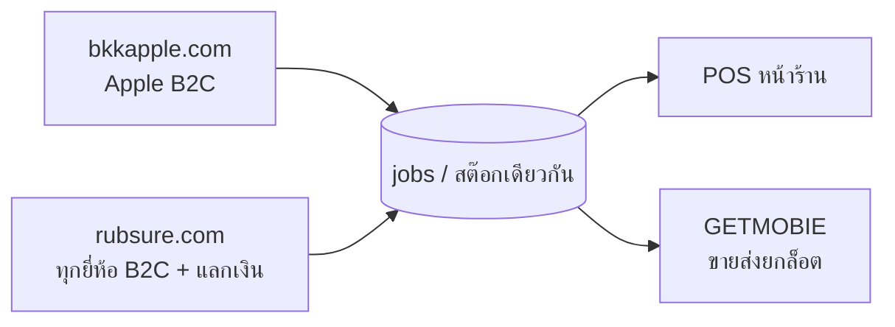
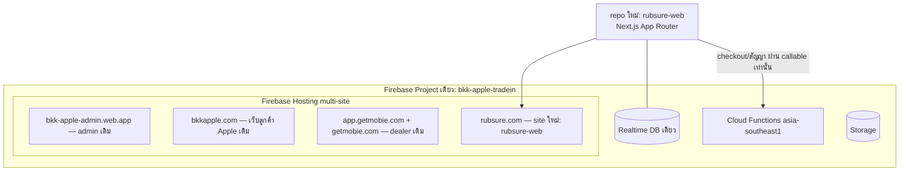
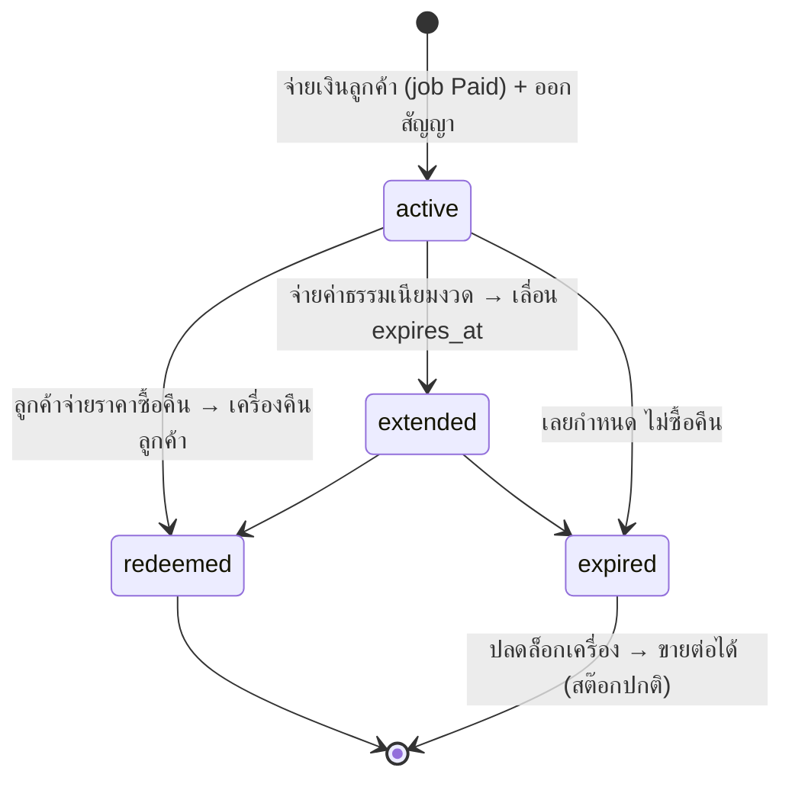

# RUBSURE (รับชัวร์ / rubsure.com) — เว็บรับซื้อ-แลกเงิน ทุกยี่ห้อ (Design Doc)

> สถานะ: **ข้อเสนอการออกแบบ (ยังไม่ implement)** — เขียน ส.ค. 2026
> โจทย์: ใช้โดเมน `rubsure.com` ทำเว็บ "รับซื้อ / รับจำนำ / โทรศัพท์แลกเงิน / iPhone แลกเงิน" ที่**กว้างกว่า BKK APPLE** — รับหลายหมวดหมู่ หลายยี่ห้อ ไม่เจาะจง Apple — โดย**ใช้ฐานข้อมูลเดียวกับระบบ BKK**
> เอกสารนี้ยึดสถาปัตยกรรมและบทเรียนเดิมของระบบ (ดู `CLAUDE.md` + `docs/dealer-portal-design.md` ซึ่งเป็น precedent ของ "แบรนด์ใหม่บนโปรเจกต์ Firebase เดิม")

---

## 1. ภาพรวมธุรกิจ — RUBSURE อยู่ตรงไหนใน portfolio

ตอนนี้ระบบมี 2 แบรนด์ที่แยกบทบาทชัดแล้ว:

| แบรนด์ | บทบาท | โดเมน | กลุ่มลูกค้า |
|---|---|---|---|
| **BKK APPLE** | รับซื้อ (B2C) เฉพาะ Apple — specialist, ราคาอ้างอิงตลาด Apple | bkkapple.com | คนใช้ Apple ที่อยากขาย |
| **GETMOBIE** | ขายส่งยกล็อต (B2B) ในนามนิติบุคคล | getmobie.com / app.getmobie.com | ดีลเลอร์ |
| **RUBSURE (ใหม่)** | รับซื้อ**ทุกยี่ห้อทุกหมวด** + ผลิตภัณฑ์ "แลกเงิน" (ขายแบบซื้อคืนได้) | rubsure.com | ตลาด mass ที่ต้องการเงินเร็ว ทุกยี่ห้อ |

จุดแข็งของการทำ RUBSURE บนฐานเดิม: **ของที่รับเข้ามาจากทุกช่องทางไหลลงสต๊อกเดียวกัน → ขายออกทาง POS หน้าร้าน + GETMOBIE ยกล็อต** โดยไม่ต้องสร้าง ops ใหม่เลย (ไรเดอร์, QC, การเงิน, ใบกำกับภาษี, ภ.พ.30, P&L ใช้ของเดิมทั้งหมด)



**การวางตำแหน่งแบรนด์ (สำคัญต่อ SEO):** BKK APPLE = ผู้เชี่ยวชาญ Apple ราคาดีเพราะโฟกัส | RUBSURE = "ขายชัวร์ ได้เงินชัวร์" ทุกยี่ห้อ เน้นความเร็ว/สภาพคล่อง คีย์เวิร์ดหลักคนละชุดกัน (ดู §9) — **อย่าให้สองเว็บแย่งคีย์เวิร์ดกันเอง** และห้ามเนื้อหาซ้ำกัน (duplicate content)

---

## 2. เรื่องต้องเคลียร์ก่อนเริ่ม: "รับจำนำ" ทำตรงๆ ไม่ได้

> **นี่คือ blocker ทางกฎหมาย ไม่ใช่ทางเทคนิค — ต้องปรึกษาทนายก่อนตัดสินใจรูปแบบผลิตภัณฑ์**

- คำว่า **"รับจำนำ"** เป็นกิจการควบคุมตาม **พ.ร.บ.โรงรับจำนำ พ.ศ. 2505** — ต้องมีใบอนุญาตโรงรับจำนำ (ออกโดยคณะกรรมการควบคุมโรงรับจำนำ กระทรวงมหาดไทย ซึ่งออกใหม่ให้เอกชนยากมาก), เพดานดอกเบี้ยถูกกำหนด, และมีข้อกำหนดหน้าร้าน/สมุดบัญชี/ตั๋วจำนำ การโฆษณาว่า "รับจำนำ" โดยไม่มีใบอนุญาตมีความเสี่ยงทางอาญา
- ธุรกิจ "มือถือแลกเงิน" ในตลาดจริงจึงมักทำในรูป **ขายฝาก** (ป.พ.พ. มาตรา 491 — กรรมสิทธิ์โอนทันที ผู้ขายมีสิทธิไถ่คืนภายในกำหนด) หรือ **"ขายแล้วซื้อคืนได้" (buyback option)** — เรารับซื้อขาดตามระบบเดิม แต่ให้ลูกค้ามี "สิทธิซื้อคืนในราคา+ค่าธรรมเนียมที่ตกลงล่วงหน้า ภายใน N วัน"
- **ข้อเสนอ:** ทำผลิตภัณฑ์ในชื่อ **"แลกเงิน — ขายวันนี้ ซื้อคืนได้ภายใน 30 วัน"** (โครงสร้างธุรกรรม = รับซื้อ + สิทธิซื้อคืน) และ**ห้ามใช้คำว่า "จำนำ" ในหน้าเว็บ/โฆษณา** จนกว่าทนายจะยืนยันว่ารูปแบบที่เลือกใช้คำนี้ได้
  - ข้อดีเชิงระบบ: ธุรกรรมขาเข้าคือ "รับซื้อ" ตามปกติ → ใช้ pipeline เดิมทั้งหมด (job, QC, จ่ายเงิน, ใบสำคัญรับเงิน, บัญชี) แล้วค่อยมี layer "สัญญาสิทธิซื้อคืน" ครอบ (ดู §7)
  - ภาษี: การขายคืนให้ลูกค้า = การขายสินค้า (output VAT) → เข้าระบบ `onSaleCreated`/ภ.พ.30 เดิมได้เลย ส่วนค่าธรรมเนียมซื้อคืนคิดรวมในราคาขายคืน
- เอกสารนี้ต่อจากนี้จะใช้คำว่า **"แลกเงิน (Buyback Option)"** แทนคำว่าจำนำทั้งหมด

---

## 3. หลักการออกแบบ (ยึดตามสถาปัตยกรรมเดิม)

| หลักการ | ที่มาในระบบเดิม |
|---|---|
| **Firebase project เดิม + Hosting site ใหม่** — ไม่แยกโปรเจกต์ | precedent: GETMOBIE (`app.getmobie.com` = multi-site บนโปรเจกต์เดียว) — แชร์ RTDB/Auth/Storage ไม่ต้อง sync ข้อมูลข้ามโปรเจกต์ |
| **แคตตาล็อกเดียว: `/models` + `/series` + `/product_categories` เดิม** ขยายด้วย `brand`/หมวดใหม่ — ไม่สร้าง node แคตตาล็อกที่สอง | ฟิลด์ `brand` มีอยู่แล้ว (default 'Apple'), schema ต่อหมวดแก้ได้จากแอดมินอยู่แล้ว (`resolveCategorySchema`) — PriceEditor ทีมเดียวดูแลราคาทุกแบรนด์ที่เดียว |
| **ออเดอร์เขียนลง `/jobs` เดิม ผ่าน `validateAndCreateOrder` เดิม** + ฟิลด์ `channel` ระบุแหล่งที่มา | อีเมล/พุช/ไรเดอร์/QC/บัญชี trigger จาก `/jobs` อยู่แล้ว — เพิ่มเว็บใหม่โดย server-side pipeline แทบไม่ต้องแตะ |
| **เรื่องเงิน/สัญญาเขียนผ่าน cloud function เท่านั้น** — rules ปิด client write | pattern เดิม (staff-accounts, dealer-portal) |
| **แบรนด์แยกขาดทุก touchpoint** — อีเมล/หน้า track/PDPA ฝั่ง RUBSURE ห้ามหลุด BKK APPLE | กฎเดียวกับ GETMOBIE. sender แยกด้วย env (precedent `DEALER_EMAIL_FROM`) |
| **ชื่อ cloud function ใหม่ prefix `rubsure*`/`adminRubsure*`** unique ระดับ project | กฎ `{region}/{name}` collision เดิม |
| **Rules ใหม่แก้ที่ `bkk-frontend-next/database.rules.json`** แล้ว deploy จาก repo นั้น | canonical เดิม |
| **ระวังบิล RTDB ตั้งแต่วันแรก** — ISR ≥300s, ห้าม subscribe/กวาด node ใหญ่ | บทเรียนบิล ก.ค. 2026 |

---

## 4. สถาปัตยกรรม — เว็บใหม่อยู่ไหน

### ทางเลือกที่พิจารณา

| ทางเลือก | ข้อดี | ข้อเสีย | ตัดสิน |
|---|---|---|---|
| **A. แอป Next.js ใหม่ (repo ใหม่ `rubsure-web`) บนโปรเจกต์ Firebase เดิม** | แบรนด์/SEO/โค้ดแยกขาด ไม่เสี่ยงกระทบ bkkapple.com ที่ติดอันดับอยู่; โครงสร้างเลียนแบบ bkk-frontend-next ได้เลย; deploy แยกอิสระ | ต้อง mirror helper บางตัว (ธรรมเนียม repo นี้ทำอยู่แล้ว: pricingResolver mirror 4 ที่) | **เลือก** |
| B. ทำ bkk-frontend-next เป็น multi-tenant ตามโดเมน (rewrite per host) | โค้ดชุดเดียว | เว็บที่ทำ SEO ได้แล้วกลายเป็นตัวประกันของทุก deploy ฝั่ง RUBSURE; routing/branding/i18n ปนกันซับซ้อน; robots/sitemap/structured data ต้องแตกตามโฮสต์ทุกจุด | ไม่เอา |
| C. โปรเจกต์ Firebase แยก + sync ข้อมูล | isolation สูงสุด | ต้อง sync `/models`, `/jobs`, สต๊อก ข้ามโปรเจกต์ = งาน infra ถาวร + ขัดโจทย์ "ใช้ฐานข้อมูลเดียวกัน" | ไม่เอา |

### Topology (ทางเลือก A)



- **Stack ของ `rubsure-web`:** Next.js (App Router) + ISR 300s แบบเดียวกับ bkk-frontend-next — เพราะโจทย์ SEO เหมือนกันเป๊ะ (หน้า price-table/FAQ/JSON-LD ต้อง server-render)
- **บูตโครงจาก bkk-frontend-next:** คัดลอกเฉพาะแกน (data fetch layer `/models.json`+`/series.json`, pricingResolver, couponEligibility, โครง checkout, หน้า track) แล้วเปลี่ยน design system/copy ทั้งหมดเป็น RUBSURE — **อย่า fork ทั้ง repo** (จะลากหนี้ Apple-specific routes เช่น `/apple-watch` มาด้วย)
- **Auth:** Firebase Auth เดิม → บัญชีลูกค้า **ใช้ร่วมกันสองเว็บได้เลย** (คนเคยขายกับ BKK login ที่ RUBSURE เห็นประวัติ/คูปองตัวเอง — จุดขาย). ต้องเพิ่ม `rubsure.com` ใน Authorized domains
- **นิติบุคคล/PDPA:** ใช้บริษัท เก็ทโมบี้ จำกัด เป็น data controller โดยมี RUBSURE เป็น trade name (แบบเดียวกับ BKK APPLE) → หน้า privacy/terms ของ rubsure.com ต้องเปิดด้วยชื่อนิติบุคคลตามกติกาเดิม และเพิ่ม activity ใน `docs/pdpa-ropa.md`

---

## 5. ขยายแคตตาล็อกให้เป็น multi-brand

### 5.1 ของที่มีอยู่แล้ว (ไม่ต้องแก้ schema)

- `/models` มี `brand` (ตอนนี้ default 'Apple'), `category`, `series`, variants, ราคา
- `/series` ผูก `brand` + `category` อยู่แล้ว (`ModelEditorPage` filter series ตาม brand+category แล้วด้วยซ้ำ)
- `/product_categories` + `CATEGORY_SCHEMAS` — เพิ่มหมวดใหม่พร้อม attribute schema ได้จากแอดมินโดยไม่ต้อง deploy (มี fallback ฝั่งโค้ด)
- Condition sets รองรับ `pct` (เปอร์เซ็นต์ของราคา) อยู่แล้ว — สำคัญมากสำหรับ Android (ดู 5.3)

### 5.2 สิ่งที่ต้องเพิ่ม

| งาน | รายละเอียด |
|---|---|
| Node `/brands` (หรือขยาย list ที่ PriceEditor ใช้) | Samsung, Xiaomi, OPPO, vivo, HONOR, Huawei, realme, Google, Nintendo, Sony, Canon ฯลฯ + โลโก้ + ลำดับแสดงผล |
| หมวดใหม่ + schema | เช่น `Android Phone {storage, ram}`, `Windows Laptop {cpu, ram, storage, gpu}`, `Gaming Handheld` — เพิ่มผ่าน `/product_categories` |
| ฟิลด์ `visible_channels: string[]` บน model/series (optional) | คุมว่ารุ่นไหนโชว์เว็บไหน — default ไม่มีฟิลด์ = โชว์ทุกเว็บ. BKK โชว์เฉพาะ Apple อยู่แล้วโดยธรรมชาติ (หน้า category ของมัน hardcode Apple) จึงแทบไม่ต้องใช้ แต่มีไว้กันเคสพิเศษ |
| ตรวจ consumer ของ `/models.json` เดิม | bkk-frontend-next ดึงทั้งก้อน — แคตตาล็อกโตขึ้นหลายเท่า = ทุก revalidate แพงขึ้น (ดู §10 เรื่องบิล) |

### 5.3 กลยุทธ์ราคา Android (ปัญหาจริงของ multi-brand)

Android รุ่นเยอะ ราคาตกเร็ว ดูแลราคาแบบ BKK (เคาะรายรุ่น) ไม่ไหว — เสนอแบ่ง 2 ชั้น:

1. **รุ่นยอดนิยม (~top 100–200):** มีราคาในระบบจริง เหมือน Apple — ลูกค้าเห็นราคาทันที กดขายได้เลย. Condition set ใช้แบบ **`pct` ต่อหมวด/ช่วงราคา** (ไม่ต้อง 1 ชุดต่อรุ่นแบบ Apple เพราะเปอร์เซ็นต์ scale ตามราคาเอง)
2. **รุ่น long-tail:** ไม่ต้องมีราคาล่วงหน้า — ใช้ flow ใหม่ **"ขอราคาด่วน" (Quote Request)**: ลูกค้าเลือกยี่ห้อ/พิมพ์รุ่น + สภาพ + รูป → สร้าง job status `New Lead` พร้อม flag `pricing_pending` → แอดมินเคาะราคาใน ticket แล้วระบบแจ้งลูกค้า (พุช/อีเมล/แชทเดิม) → ลูกค้ากดยืนยันเป็นออเดอร์
   - ใช้ Negotiation/chat pipeline เดิมได้ทั้งหมด — ที่เพิ่มคือหน้า form ฝั่งเว็บ + สถานะแสดงผล "รอราคา" ในหน้า track
   - นี่ยังเป็นตัวเก็บ demand data ฟรี: รุ่นไหนถูกขอเยอะ → ค่อยยกเป็นชั้นที่ 1

### 5.4 ตรวจสอบเครื่อง

- SickW (GSX/FMI/iCloud) เป็นของ Apple — **Android ไม่มีตัวเทียบตรง**: ใช้ IMEI blacklist check (บริการภายนอก เช่น imeicheck) + ขั้นตอน QC ภาคบังคับ (ลบบัญชี Google/FRP, factory reset) เป็น checklist ใน QCStation แทน
- BKK Diagnos (App Clip) เป็น iOS-only — ฝั่ง Android เฟสแรกใช้รูปถ่าย + คำถามสภาพแบบเว็บปกติไปก่อน (web-based diagnos ของเดิมใช้ได้ข้ามยี่ห้อบางส่วนอยู่แล้ว)

---

## 6. ออเดอร์รับซื้อจาก rubsure.com — ใช้ pipeline เดิม + `channel`

### 6.1 ฟิลด์ใหม่บน job: `channel`

- `jobs/{id}/channel: 'bkkapple' | 'rubsure'` (ไม่มีฟิลด์ = 'bkkapple' — backward compat, **ห้าม backfill**)
- คนเขียน: `validateAndCreateOrder` (รับ param จาก client แต่ validate ค่า enum) และ TradeInDashboard ฝั่งแอดมิน (dropdown ตอนสร้าง ticket เอง)
- คนอ่าน (ต้องไล่ให้ครบตามธรรมเนียม grep ทั้ง 3 repo):
  - **อีเมล (`functions/email.js`):** เลือก shell/แบรนด์/sender ตาม channel — env ใหม่ `RUBSURE_EMAIL_FROM` (`RUBSURE <noreply@rubsure.com>` — verify โดเมนใน Resend ก่อน) + `RUBSURE_TRACKING_BASE_URL`. เนื้อหา template กลางเดิมใช้ร่วมได้ เปลี่ยนเฉพาะหัว/สี/ชื่อแบรนด์ (pattern เดียวกับ `dealerShell()`)
  - **ใบสำคัญรับเงิน/ใบกำกับภาษี:** นิติบุคคลเดียวกัน → เนื้อหาเอกสารถูกต้องอยู่แล้ว ไม่ต้องแตะ (แสดง trade name ตาม channel ได้เป็น cosmetic)
  - **หน้า track:** ลูกค้า RUBSURE ต้อง track บน rubsure.com — ลิงก์ในอีเมล/SMS ชี้ตาม channel
  - **Admin UI:** filter/badge ตาม channel ใน TradeInDashboard + Analytics/CEODashboard แยกยอดต่อ channel (มิติเดียวกับที่ `sold_channel` ทำฝั่งขายออก)
  - **Notification:** payload พุชแอดมินใส่ชื่อ channel ("งานใหม่ [RUBSURE]") — ไม่ต้องเพิ่มหมวดใหม่ใน notification settings (ยังเป็น `new_ticket` เดิม)
- **สิ่งที่ไม่เปลี่ยนเลย:** สูตร `net_payout`, `pickup_fee` โซนราคา, ไรเดอร์, QC, สต๊อก, ภ.พ.30 — channel เป็นแค่มิติ ไม่ใช่ pipeline ใหม่

### 6.2 Receive methods

ใช้ 3 แบบเดิม (Pickup / Store-in / Mail-in) + โซนราคา pickup เดิม — สาขาใน `settings/branches` เป็นชุดเดียวกัน (สาขาเดียวรับได้ทั้งสองแบรนด์; ป้ายหน้าร้านเป็นเรื่องหน้างาน)

---

## 7. "แลกเงิน" (Buyback Option) — bounded context ใหม่

> โมเดลธุรกรรม (จาก §2): **รับซื้อขาดตามปกติ + ออกสัญญาสิทธิซื้อคืนให้ลูกค้า** ภายใน N วัน ที่ราคา `payout + fee`. เครื่องเข้าสต๊อกแต่ถูก**ล็อกห้ามขายจนกว่าสิทธิจะหมดอายุ** (แบบเดียวกับที่ lot ล็อกเครื่องด้วย `Reserved`)

### 7.1 Node ใหม่ (prefix ชัด, เขียนผ่าน function เท่านั้น)

```
buyback_contracts/{contractId}
  job_id, channel: 'rubsure'
  uid                      // ลูกค้า (อ่านของตัวเองได้)
  principal                // เงินที่จ่ายลูกค้า (= net_payout ของ job)
  fee, fee_schedule        // ค่าธรรมเนียมซื้อคืน (คงที่หรือขั้นบันไดตามจำนวนวัน)
  repurchase_price         // ราคาซื้อคืนรวม ณ ตอนนี้ (server คิด)
  starts_at, expires_at    // อายุสิทธิ (เช่น 30 วัน)
  extended_until?          // ต่ออายุ (จ่าย fee งวดเดิมก่อน)
  status: active | redeemed | extended | expired | closed
  redeemed_sale_id?        // ผูกกับ /sales ตอนซื้อคืน
buyback_audit/{contractId}/{eventId}   // append-only
```

### 7.2 Lifecycle



### 7.3 จุดสัมผัสโดเมนหลัก (ประกาศไว้ ทำฝั่ง server เท่านั้น — แบบเดียวกับ dealer portal)

| จุดสัมผัส | ใครทำ |
|---|---|
| ออกสัญญาตอน job (ที่ติด flag แลกเงิน) ถึงสถานะ Paid → เขียน contract + ตั้ง `jobs/{id}/buyback_lock: contractId` | trigger `onRubsureBuybackContractIssue` |
| Inventory/POS/Lot picker **ต้องกรองเครื่องที่มี `buyback_lock`** ออกจากของขายได้ | client filter + guard ใน `adminDealerLotPublish` |
| ลูกค้าซื้อคืน (โอน+สลิป → แอดมินยืนยัน) → เขียน `/sales` (`sold_channel: 'buyback_redeem'`, ผู้ซื้อ = ลูกค้าเดิม) → `onSaleCreated` เดิมออกใบกำกับ/ลงบัญชีให้ครบ + ตัดสต๊อก + ปิดสัญญา | callable `adminRubsureRedeemConfirm` |
| หมดอายุ → ปลด `buyback_lock` เครื่องกลายเป็นสต๊อกขายได้ปกติ | scheduler `rubsureBuybackScheduler` |

### 7.4 Scheduler + แจ้งเตือน

- `rubsureBuybackScheduler` (รายชั่วโมงพอ — **query ตาม `.indexOn: status`+`expires_at` ห้ามกวาดทั้ง node** ตามกฎบิล): เตือนลูกค้าก่อนหมดอายุ (7/3/1 วัน — อีเมล+พุช) → หมดอายุแล้ว flip `expired` + ปลดล็อก + แจ้งแอดมิน
- Notification หมวดใหม่ `buyback` (types: `buyback_expiring`, `buyback_redeemed`, `buyback_expired`) — **mirror 2 ไฟล์ตามกฎเดิม** (`functions/notification-settings.js` + `src/utils/notificationSettings.ts`)
- ฝั่งลูกค้าบน rubsure.com: หน้า "สัญญาของฉัน" อ่าน `buyback_contracts` ของ uid ตัวเอง (rules: read เจ้าของ, write ปิด)

### 7.5 Admin UI

- หน้าใหม่ `/buyback-contracts` ใน bkk-system (CEO/MANAGER/FINANCE): ตารางสัญญา active/ใกล้หมด/หมดอายุ, ยอด principal ค้าง, ปุ่มยืนยันการซื้อคืน/ต่ออายุ (ยิง callable), export CSV
- เพิ่ม entry ใน `settingsNav.tsx` สำหรับตั้งค่า fee schedule (`settings/rubsure/buyback`: อัตรา fee, จำนวนวัน default, เพดาน principal ต่อเครื่อง/ต่อลูกค้า)

### 7.6 การควบคุมความเสี่ยง (ต้องมีตั้งแต่ MVP)

- เพดานวงเงินต่อลูกค้า (KYC เดิมช่วยยืนยันตัวตนอยู่แล้ว — flow แลกเงิน**บังคับ KYC ทุกเคส**)
- เครื่องที่รับเข้าทาง "แลกเงิน" ตรวจ FMI/blacklist เข้มเท่าการรับซื้อปกติ (ของโจรชอบช่องทางเงินด่วน — เป็นเหตุผลที่ต้องมี audit trail + KYC แน่น)
- ราคารับ (principal) ควรตั้ง **ต่ำกว่าราคารับซื้อขาด** (เช่น 70–80%) — เผื่อ margin กรณีหมดอายุแล้วต้องขายเครื่องที่ราคาตกลง

---

## 8. โครงหน้าเว็บ rubsure.com (MVP)

| หน้า | อ้างอิงของเดิม | หมายเหตุ |
|---|---|---|
| Home | bkk-frontend-next home | Hero สองปุ่มใหญ่: "ขายเลย" / "แลกเงิน" + แถบยี่ห้อ + ราคาอัปเดต |
| `/[brand]` เช่น `/samsung`, `/xiaomi` | หน้า category เดิม (`/iphone`) | dynamic ตาม `/brands` ไม่ hardcode แบบ BKK |
| `/[brand]/[model]` | หน้า detail เดิม | ราคา + FAQ + JSON-LD (สูตร SEO เดิม) |
| `/sell` (เลือกเครื่อง→สภาพ→ราคา→checkout) | flow `sell`/`checkout` เดิม | เพิ่มทาง "ไม่พบรุ่น? ขอราคาด่วน" (§5.3) |
| `/exchange` (แลกเงิน) | ใหม่ | อธิบายเงื่อนไข + คำนวณวงเงินเบื้องต้น + เข้า flow เดียวกับ sell แต่ติด flag |
| `/track/[jobId]` | หน้า track เดิม | อ่าน `public_track` mirror เดิมได้เลย |
| `/profile` (ประวัติ, คูปอง, สัญญาแลกเงิน) | profile เดิม | บัญชีร่วมกับ BKK |
| `/price-table/[brand]` | price-table เดิม | อาวุธ SEO หลัก |
| privacy/terms/cookies | ของเดิม | เปลี่ยน trade name เป็น RUBSURE, นิติบุคคลเดิม |

Design system: คนละชุดกับ BKK APPLE ทั้งหมด (สี/ฟอนต์/โทน) — โทนแบรนด์ "ชัวร์/ไว/ตรงไปตรงมา" ตลาด mass ภาษาไทยนำ (i18n /en ค่อยตามใน phase หลังด้วยโครง dictionary เดิม)

---

## 9. SEO — สนามที่ RUBSURE ต้องชนะ

- **ชุดคีย์เวิร์ดของ RUBSURE:** "รับซื้อมือถือ", "ขายมือถือด่วน", "มือถือแลกเงิน", "iPhone แลกเงิน", "รับซื้อ Samsung/Xiaomi/OPPO", "ขายโน้ตบุ๊ก" — เจตนาค้นหา (intent) คือ **เงินด่วน + ทุกยี่ห้อ** ต่างจาก BKK ("ขาย iPhone ราคาดี" = intent ราคาสูงสุดของคน Apple)
- คำว่า "iPhone แลกเงิน" อยู่ฝั่ง RUBSURE (intent = เงินด่วน ไม่ใช่ขายขาด) — BKK ไม่ทำหน้าแลกเงิน จึงไม่ชนกัน; ส่วนคีย์เวิร์ด "ขาย iPhone / รับซื้อ iPhone" ยกให้ BKK ต่อ — RUBSURE มีหน้า Apple ได้แต่**อย่า optimize ชนตรงๆ** และลิงก์ข้ามไป bkkapple.com สำหรับ intent ขายขาด (แบรนด์ค้ำกันเอง)
- ใช้สูตรเดิมที่พิสูจน์แล้วของ BKK: FAQ ข้อแรกแสดงราคาจริง min–max จาก database, JSON-LD ทั้ง server+client, evergreen copy ("ราคาล่าสุด อัปเดตอัตโนมัติ"), Zero-click strategy
- เพิ่มของใหม่ที่ BKK ไม่มี: **หน้าเทียบราคาข้ามยี่ห้อ** ("ขาย Galaxy S24 ได้เท่าไหร่ vs iPhone 15") — เสิร์ฟ intent เปรียบเทียบที่เว็บเจาะยี่ห้อเดียวทำไม่ได้ และตอกย้ำ positioning "ราคากลางทุกยี่ห้อ" ตาม vision เดิมของธุรกิจ

---

## 10. ต้นทุน RTDB / ความเสี่ยง / ข้อควรระวัง

| เรื่อง | ผลกระทบ | แนวรับ |
|---|---|---|
| แคตตาล็อกโต 3–5 เท่า → `/models.json` ก้อนใหญ่ขึ้น | ทุก ISR revalidate (ทั้ง 2 เว็บ) + ทุก consumer ที่ดึงทั้งก้อน แพงขึ้นตามขนาด | เฟสแรก: คุม catalog Android ที่ top-N รุ่น; ระยะกลาง: แตก endpoint อ่านเป็นราย brand/category (`/models` query ด้วย `.indexOn: brand`) แล้วให้หน้าเว็บดึงเฉพาะส่วนที่ใช้ — **ต้องทำก่อนเปิด catalog เต็ม** |
| เว็บใหม่ = ผู้อ่าน RTDB เพิ่มอีกหนึ่ง | บิล download | ISR 300s เท่าเดิม, `public_track` mirror เดิม (อ่านรายใบ), ห้าม client subscribe node ใหญ่ — กฎเดิมทั้งหมด apply |
| ราคา Android ตกเร็ว/ผันผวน | ราคาบนเว็บเก่า = จ่ายแพงเกิน หรือลูกค้าผิดหวังตอนกดราคาถูกลง | ระบบ "อายุราคา" (ฟิลด์ `price_updated_at` + banner "ราคายืนยันอีกครั้งตอนตรวจเครื่อง") + Quote Request สำหรับ long-tail แทนการการันตีราคาทุกรุ่น |
| ops รับเครื่องหลายยี่ห้อ | QC ต้องรู้จักเครื่องที่ไม่ใช่ Apple (FRP, Mi account, Knox ฯลฯ) | checklist QC ต่อ brand ใน QCStation + คู่มือภายใน — งานคน ไม่ใช่งานระบบ แต่ต้องวางก่อนเปิด |
| กฎหมาย "จำนำ" | ความเสี่ยงอาญา/ปิดเว็บ | ทำตาม §2 — โครงสร้าง "ซื้อ+สิทธิซื้อคืน", เลี่ยงคำว่าจำนำ, ปรึกษาทนายก่อน launch หน้า `/exchange` |
| เครื่องหลุดขายทั้งที่ติดสัญญาแลกเงิน | ลูกค้ามาไถ่แต่เครื่องไม่อยู่ = คดี | `buyback_lock` บังคับใน **ทุก** ทางขายออก (POS, lot publish, mark sold ใน Inventory) — ต้อง grep ทุกจุดที่เปลี่ยน status เป็น Sold ตอน implement |

---

## 11. แผนทำงานเป็นเฟส

| เฟส | ขอบเขต | Definition of done |
|---|---|---|
| **0. Foundation** | ตัดสินใจกฎหมาย (§2) กับทนาย · จอง/ตั้ง DNS rubsure.com · Hosting site ใหม่ + Authorized domain · verify โดเมนใน Resend · สรุป brand identity | เปิด placeholder page ได้, อีเมลทดสอบส่งจาก @rubsure.com ผ่าน |
| **1. Catalog multi-brand** | เพิ่ม brands/categories/schema + ราคา Android top-N ใน PriceEditor · condition sets แบบ `pct` ต่อหมวด · (เริ่มงานแตก endpoint models ราย brand ถ้า catalog ใหญ่เกิน) | แอดมินสร้าง ticket เครื่อง Samsung ผ่าน flow เดิมได้จบวง (ราคา→QC→จ่าย→สต๊อก→ขาย) — **พิสูจน์ backend ก่อนมีเว็บ** |
| **2. rubsure-web MVP (รับซื้อ)** | repo ใหม่ · Home/brand/model/sell/checkout/track/profile · `channel` บน job + อีเมล/track/admin filter ตาม channel · Quote Request สำหรับ long-tail | ลูกค้าขายเครื่อง Android ผ่าน rubsure.com จบวงจริง อีเมลทุกฉบับเป็นแบรนด์ RUBSURE |
| **3. แลกเงิน (Buyback Option)** | `buyback_contracts` + functions + scheduler + lock ทุกทางขายออก · หน้า `/exchange` + "สัญญาของฉัน" · admin `/buyback-contracts` + settings | สัญญาครบวงจร: ออก→เตือน→ไถ่คืน (ออกใบกำกับผ่าน `onSaleCreated`) / หมดอายุ→ปลดล็อกขายต่อ |
| **4. SEO + Growth** | price-table ทุก brand · หน้าเทียบข้ามยี่ห้อ · i18n /en · blog/content | อันดับคีย์เวิร์ดเป้าหมายชุด RUBSURE เริ่มติด โดยอันดับของ bkkapple.com ไม่ตก |

หมายเหตุลำดับ: **เฟส 1 มาก่อนเว็บเสมอ** — ถ้า ops รับ Android ยังไม่จบวงในระบบแอดมิน การเปิดเว็บคือการรับออเดอร์ที่หลังบ้านยังทำไม่ได้

---

## 12. คำถามเปิด (ต้องตอบก่อนเริ่ม implement)

1. **กฎหมาย:** ยืนยันรูปแบบ "ซื้อ+สิทธิซื้อคืน" กับทนายแล้วหรือยัง? ต้องจดทะเบียนอะไรเพิ่มไหม (เช่น ทะเบียนผู้ค้าของเก่า ครอบคลุมหมวดใหม่ๆ ที่จะรับหรือยัง)?
2. **แบรนด์บนเอกสาร:** ใบสำคัญรับเงิน/ใบกำกับของออเดอร์ RUBSURE จะโชว์ trade name "RUBSURE" หรือใช้ชื่อบริษัทล้วน? (นิติบุคคลเดียวกัน — เป็นการตัดสินใจด้านภาพลักษณ์ ไม่ใช่กฎหมาย)
3. **ขอบเขตหมวดเฟสแรก:** เริ่มที่มือถือทุกยี่ห้อก่อน แล้วค่อยขยาย โน้ตบุ๊ก/กล้อง/เกม? (แนะนำ: ใช่ — QC ops ต่อหมวดคือคอขวดจริง)
4. **แลกเงินรับเฉพาะยี่ห้อ/รุ่นที่ขายต่อง่ายไหม?** (แนะนำ: เฟสแรกจำกัด iPhone + Samsung flagship — ราคาขายต่อเสถียรสุด ความเสี่ยงหมดอายุต่ำสุด)
5. **ทีมดูแลราคา Android:** ใครเคาะราคา top-N รายสัปดาห์? (กระทบขนาด catalog ที่เปิดได้จริง)
